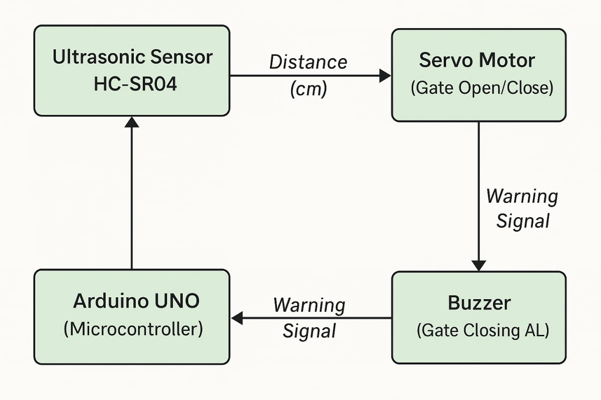
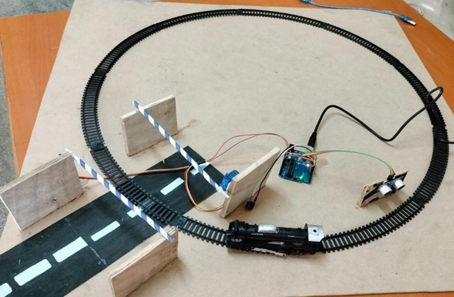

# Automatic Railway Gate Control System

## Description

This project is an automated railway gate control system designed to improve safety at railway crossings. The system detects approaching trains and automatically controls the opening and closing of the gate.

## Componenets Used

* Arduino Uno
* Ultrasonic sensor (HC-SR04)
* Servo Motor
* Buzzer
* Jumper Wires

## Working Principle

The ultasonic sensor continuously measures the distance of an approaching object. When detected within a predefined range, the Arduino processes the signal and activates the servo motor to close the gate. A buzzer alerts nearby people. Once the object moves away, the gate reopens automatically.

## Technologies Used

* Embedded C
* Arduino IDE

## Applications

* Railway crossing automation
* Accident prevention systems
* Smart transportation systems

## Future Improvements

* Integration with IoT for remote monitoring
* Use of IR sensors for better accuracy
* GSM-based alert system

## Block Diagram

## Project Model

